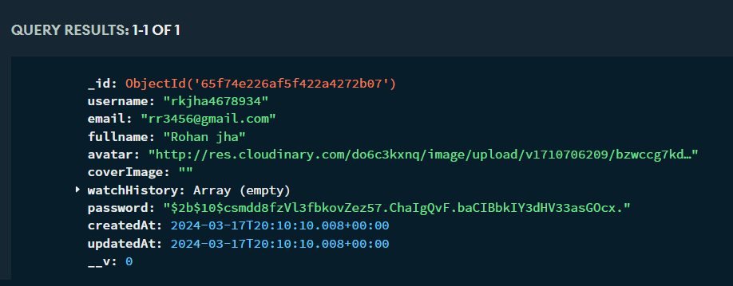
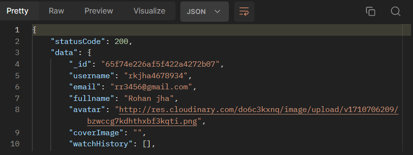

# Backend with JavaScript

This is the backend portion of our web application, built using JavaScript. Below are the key components and technologies used in our backend setup:

## Technologies Used:

- **MongoDB Atlas**: We utilize MongoDB Atlas, a cloud-based database service, for storing our data. MongoDB is a NoSQL database, offering flexibility and scalability.

- **bcrypt**: To ensure secure password storage, we employ bcrypt, a library for hashing passwords. This helps in safeguarding user credentials even if the database is compromised.

- **JSON Web Tokens (JWT)**: JWT is employed for authentication purposes. Upon successful login, users receive a JWT token, which they include in subsequent requests. This enables the server to authenticate users without storing their credentials on every request.

- **mongooseAggregatePaginate**: This is a plugin for Mongoose, our Object Data Modeling (ODM) library for MongoDB and Node.js. It enables efficient pagination of data retrieved through Mongoose's aggregation framework, allowing us to manage and display large datasets effectively.

- **Multer**: Multer is used for handling multipart/form-data, primarily used for file uploads. It allows us to handle file uploads securely and efficiently.

- **Cloudinary**: Cloudinary is a cloud-based image and video management service. We use Cloudinary for storing and managing images uploaded by users. It offers features like image transformation, optimization, and storage.

## Installation Instructions:

1. **Clone the Repository**: 


## Installation Instructions:

1. **Clone the Repository**: 
Replace `your/repository` with the URL of your GitHub repository.

2. **Install Dependencies**: 
This command will install all the required dependencies listed in the `package.json` file.

3. **Environment Variables**:
- Create a `.env` file in the root directory.
- Define environment variables such as database connection URI, JWT secret key, etc.
- Example:
  ```
  PORT=3000
  MONGODB_URI
  CLOUDINARY_API_SECRET
  REFRESH_TOKEN_SECRET
  REFRESH_TOKEN_EXPIRY
  CLOUDINARY_API_KEY
  DB_URI=<Your MongoDB Atlas Connection URI>
  JWT_SECRET=<Your Secret Key for JWT>
  ```

4. **Start the Server**:
This command will start the server. By default, it will run on port 3000, unless specified otherwise in the environment variables.

5. **Verify Installation**:
Once the server is running, you can test the endpoints using tools like Postman or by integrating with your frontend application.

## Additional Information:

- **Model Link**: [Link to the model](https://app.eraser.io/workspace/vGobqnb6scZbLfZWzhdm?origin=share)
- 


- 


This README provides a brief overview of our backend setup, highlighting the key technologies and components used in our project. For more detailed information, please refer to our codebase.

# postman
[postman collection link what i have tested](https://www.postman.com/lunar-module-meteorologist-40782529/workspace/youtubelikebackend/collection/33197751-a4f7d08f-6131-4b1b-940a-0a83361d93a5?action=share&creator=33197751)


    
